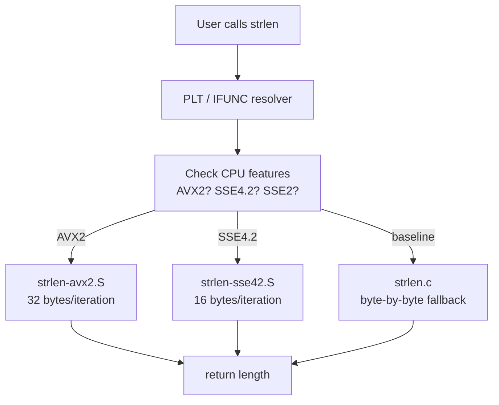

# GNU C Library (glibc) In The Mind

## Understanding glibc Before Code

> This isn't just a guide to using the C library. It's an effort to understand the foundation of every program on Linux.

The GNU C Library (glibc) is the critical bridge between user programs and the Linux kernel. It provides the system call interface, implements the C standard library, and offers POSIX-compliant APIs that nearly every Linux program depends on. Understanding glibc means understanding how user-space programs interact with the kernel, how memory is managed, how threads work, and how standard functions are optimized for performance.

Every time you call `printf()`, `malloc()`, `pthread_create()`, or even `main()`, you're executing glibc code. It's the invisible foundation that makes Linux programming possible.

**glibc powers every Linux program. Let's understand how it works.**

---
id: ch1
title: Chapter 1 — Introduction to glibc
fileRecommendations:
  docs:
    - path: manual/
      description: glibc manual source
    - path: INSTALL
      description: Build and installation instructions
  source:
    - path: sysdeps/x86_64/start.S
      description: Program startup — _start assembly entry point
    - path: csu/libc-start.c
      description: __libc_start_main — sets up runtime and calls main()
    - path: sysdeps/unix/sysv/linux/x86_64/syscall.S
      description: x86-64 syscall assembly wrapper
    - path: stdio-common/vfprintf-internal.c
      description: Core printf formatting (~1,570 lines)
    - path: elf/rtld.c
      description: Dynamic linker / runtime loader (~3,000 lines)
---

## Chapter 1 — Introduction to glibc

### The Bridge Between User Space and Kernel

glibc serves multiple critical roles:

- **System call wrapper**: Provides C functions that invoke Linux syscalls
- **Standard library**: Implements C11/C17 standard functions
- **POSIX layer**: Implements POSIX specifications (threads, IPC, etc.)
- **Optimization layer**: Provides architecture-specific optimized code
- **Dynamic linker**: `ld.so` loads and links shared libraries

**The Call Chain:**

```
Your Code: printf("Hello\n");
    ↓
glibc: printf() in stdio/printf.c
    ↓
glibc: vfprintf() - formatting logic
    ↓
glibc: write() wrapper in sysdeps/unix/sysv/linux/
    ↓
Kernel: syscall entry (arch/x86/entry/entry_64.S)
    ↓
Kernel: sys_write() in fs/read_write.c
    ↓
Hardware: Terminal output
```

### Key Concepts Deep Dive

**1. System Call Wrappers**

Every Linux system call has a glibc wrapper. Example: `read()`:

```c
// User calls:
ssize_t n = read(fd, buf, sizeof(buf));

// glibc wrapper (sysdeps/unix/sysv/linux/read.c):
ssize_t __libc_read(int fd, void *buf, size_t nbytes) {
    return INLINE_SYSCALL_CALL(read, fd, buf, nbytes);
}
weak_alias(__libc_read, read)
```

**The syscall happens through:**

```assembly
; x86-64 syscall (sysdeps/unix/sysv/linux/x86_64/syscall.S)
mov $0, %rax        ; syscall number for read
mov %rdi, %rdi      ; arg1: fd (already in rdi)
mov %rsi, %rsi      ; arg2: buf
mov %rdx, %rdx      ; arg3: count
syscall             ; invoke kernel
ret
```

**2. Standard C Library Implementation**

glibc implements all standard C functions:

- **stdio.h**: Buffered I/O (`printf`, `fopen`, `fread`)
- **string.h**: String operations (`strcpy`, `strlen`, `memcpy`)
- **stdlib.h**: General utilities (`malloc`, `qsort`, `atoi`)
- **math.h**: Mathematical functions (`sin`, `cos`, `sqrt`)

**Example: strlen() optimization**

```c
// Naive implementation:
size_t strlen(const char *s) {
    const char *p = s;
    while (*p) p++;
    return p - s;
}

// Optimized x86-64 SIMD version (sysdeps/x86_64/multiarch/strlen-avx2.S):
// - Loads 32 bytes at a time using AVX2
// - Processes 4x faster than byte-by-byte
// - Uses pcmpeqb to find null terminators in parallel
```

**3. POSIX Compliance**

POSIX defines a standard interface for Unix-like systems. glibc implements:

- **Threads (pthreads)**: `pthread_create`, `pthread_mutex_lock`
- **File I/O**: `open`, `read`, `write`, `fcntl`
- **Processes**: `fork`, `exec`, `wait`
- **Signals**: `signal`, `sigaction`, `kill`
- **IPC**: Pipes, message queues, shared memory

**4. Threading Support (NPTL)**

Native POSIX Thread Library (NPTL) is glibc's threading implementation:

- **1:1 threading model**: One kernel thread per pthread
- **Futex-based locking**: Fast user-space mutexes
- **Thread-local storage (TLS)**: Per-thread data
- **Async-signal-safe**: Careful signal handling in threads

### Study Files (Ordered Learning Path)

**Week 1-2: System Call Interface**

1. `sysdeps/unix/sysv/linux/syscalls.list` - List of all syscalls
2. `sysdeps/unix/syscall-template.S` - Template for syscall wrappers
3. `sysdeps/unix/sysv/linux/x86_64/syscall.S` - x86-64 syscall implementation
4. `sysdeps/unix/sysv/linux/read.c` - Example: read() wrapper

**Practical Exercise:**

```bash
# Find how open() is implemented
grep -r "open" sysdeps/unix/sysv/linux/syscalls.list
# Study: sysdeps/unix/sysv/linux/open.c
```

**Week 3-4: Standard Library Basics**

1. `string/strlen.c` - Generic strlen
2. `string/strcpy.c` - Generic strcpy
3. `string/memcpy.c` - Generic memcpy
4. `sysdeps/x86_64/multiarch/strlen-avx2.S` - Optimized strlen

**Week 5-6: I/O and Buffering**

1. `libio/libio.h` - I/O library structures
2. `libio/fileops.c` - File operations
3. `stdio-common/vfprintf-internal.c` - Printf formatting core (~1,570 lines)
4. `libio/iofread.c` - fread() implementation

**Practical Exercise:**

```c
// Understand buffering
setbuf(stdout, NULL);  // Disable buffering
printf("Test\n");      // Immediately writes (no buffer)
```

**Month 2: Memory Management**

1. `malloc/malloc.c` - Main allocator (~6,000 lines)
2. `malloc/arena.c` - Per-thread arenas
3. `malloc/malloc.h` - Internal structures (chunk format)
4. Study malloc implementation in detail (see Chapter 3)

---
id: ch2
title: Chapter 2 — System Call Interface
fileRecommendations:
  source:
    - path: sysdeps/unix/sysv/linux/syscalls.list
      description: List of all Linux syscall wrappers
    - path: sysdeps/unix/sysv/linux/x86_64/syscall.S
      description: x86-64 syscall assembly implementation
    - path: sysdeps/unix/syscall-template.S
      description: Template for generated syscall wrappers
    - path: sysdeps/unix/sysv/linux/read.c
      description: Example: read() syscall wrapper
---

## Chapter 2 — System Call Interface

glibc provides the interface between user programs and the Linux kernel through system calls.

### System Call Wrappers

- **Direct syscalls**: Functions that directly invoke kernel syscalls
- **Cancellation points**: Functions that can be interrupted
- **Error handling**: Converting errno to appropriate error codes

### Study Files

- `sysdeps/unix/sysv/linux/x86_64/syscall.S` - System call assembly wrappers
- `sysdeps/unix/syscall-template.S` - System call template
- `sysdeps/unix/sysv/linux/x86_64/` - x86-64 specific syscalls

---
id: ch3
title: Chapter 3 — Memory Management Deep Dive
fileRecommendations:
  source:
    - path: malloc/malloc.c
      description: Main allocator (~6,000 lines) — the whole implementation
    - path: malloc/arena.c
      description: Per-thread arena management
    - path: malloc/malloc-internal.h
      description: Internal macros, chunk structure, bin definitions
    - path: malloc/hooks.c
      description: malloc hooks for debugging and instrumentation
---

## Chapter 3 — Memory Management Deep Dive

glibc's malloc is one of the most sophisticated memory allocators in existence. Understanding it reveals fundamental concepts in systems programming: memory organization, performance optimization, thread safety, and fragmentation management.

### malloc Philosophy: Balancing Speed, Space, and Safety

The allocator must satisfy competing goals:

- **Speed**: Allocations must be fast (nanoseconds)
- **Space efficiency**: Minimize fragmentation and overhead
- **Thread safety**: Support concurrent allocations
- **Scalability**: Perform well with many threads
- **Security**: Resist heap exploitation

### Core Concepts

**1. Chunks: The Basic Unit**

Memory is managed in chunks. Each chunk has a header:

```c
// Simplified chunk structure (from malloc/malloc.c)
struct malloc_chunk {
    size_t prev_size;  // Size of previous chunk (if free)
    size_t size;       // Size of this chunk (includes header)

    // For free chunks only:
    struct malloc_chunk *fd;  // Forward pointer (next in bin)
    struct malloc_chunk *bk;  // Back pointer (previous in bin)

    // User data starts here for allocated chunks
};
```

**Chunk Header Details:**

- `size` field includes 3 flag bits in low bits:
  - `PREV_INUSE` (0x1): Previous chunk is allocated
  - `IS_MMAPPED` (0x2): Chunk obtained via mmap
  - `NON_MAIN_ARENA` (0x4): Chunk from non-main arena
- Minimum chunk size: 32 bytes (on 64-bit)
- Chunks are always 16-byte aligned (on 64-bit)

**Example Chunk Layout:**

```
Allocated chunk:
+------------------+
| prev_size        | (used by previous chunk if it's free)
+------------------+
| size | flags     | (size includes header)
+------------------+
| user data        |
|   ...            |
+------------------+

Free chunk:
+------------------+
| prev_size        |
+------------------+
| size | flags     |
+------------------+
| fd (forward)     | Pointer to next free chunk in bin
+------------------+
| bk (back)        | Pointer to prev free chunk in bin
+------------------+
| unused space     |
+------------------+
| size | flags     | (footer, copy of size)
+------------------+
```

**2. Bins: Organizing Free Chunks**

Free chunks are organized into bins (linked lists) by size:

**Fastbins (16-80 bytes on 64-bit):**

- LIFO (stack) of recently freed chunks
- 10 bins for sizes: 16, 24, 32, ..., 80 bytes
- No coalescing (for speed)
- Single-linked list

```c
// Fastbin allocation (simplified)
if (size <= FASTBIN_MAX_SIZE) {
    fastbin_index = size >> 4;  // Divide by 16
    chunk = fastbin[fastbin_index];
    if (chunk) {
        fastbin[fastbin_index] = chunk->fd;  // Pop from stack
        return chunk;
    }
}
```

**Small bins (< 512 bytes on 64-bit):**

- 62 bins for exact sizes
- Doubly-linked list (FIFO)
- Coalescing enabled

**Large bins (>= 512 bytes):**

- 63 bins for size ranges
- Sorted by size within each bin
- Best-fit allocation

**Unsorted bin:**

- Temporary holding area for recently freed chunks
- Helps reuse recently freed memory
- Chunks sorted into appropriate bins during allocation

**3. Arenas: Multi-threaded Memory Management**

To avoid lock contention, malloc uses multiple arenas:

```c
// Main arena: Uses sbrk() to grow heap
// Thread arenas: Use mmap() for memory

struct malloc_state {
    mutex_t mutex;              // Lock for this arena
    mchunkptr bins[NBINS * 2];  // Free chunk bins
    mchunkptr top;              // Top chunk (wilderness)
    mchunkptr last_remainder;   // Last split chunk
    mfastbinptr fastbinsY[NFASTBINS];  // Fastbins
    // ... more fields
};
```

**Arena Strategy:**

- Main thread uses main arena (grows via `sbrk()`)
- Each new thread gets its own arena (up to limit)
- Arena limit: 2 _ num_cores on 32-bit, 8 _ num_cores on 64-bit
- When limit reached, threads share arenas (contention)

**4. The Top Chunk (Wilderness)**

The top chunk is the remainder of the heap:

- Always the highest chunk in arena
- Source for new allocations when bins are empty
- Grows via `sbrk()` (main arena) or `mmap()` (thread arenas)
- Shrinks when large amount is free

**5. Large Allocations via mmap**

Allocations >= 128KB (default) use mmap directly:

- Bypasses arena/bin mechanism
- Each allocation is a separate mmap region
- Freed via munmap (immediately returns to OS)
- Avoids fragmentation in main heap

### malloc() Implementation Flow

**Allocation Path:**

```c
void* malloc(size_t size) {
    // 1. Add overhead and align
    size = (size + SIZE_SZ + MALLOC_ALIGN_MASK) & ~MALLOC_ALIGN_MASK;

    // 2. Check fastbins for small sizes
    if (size <= FASTBIN_MAX_SIZE) {
        idx = fastbin_index(size);
        if ((victim = fastbin[idx]) != NULL) {
            fastbin[idx] = victim->fd;
            return chunk2mem(victim);
        }
    }

    // 3. Check small bins for exact fit
    if (in_smallbin_range(size)) {
        idx = smallbin_index(size);
        bin = bin_at(av, idx);
        if ((victim = last(bin)) != bin) {
            unlink(victim, bck, fwd);
            return chunk2mem(victim);
        }
    }

    // 4. Large allocation? Use mmap
    if (size >= mp_.mmap_threshold) {
        void *p = mmap_malloc(size);
        if (p != NULL)
            return p;
    }

    // 5. Search unsorted bin
    while ((victim = unsorted_chunks(av)->bk) != unsorted_chunks(av)) {
        // Try to use this chunk or sort it
        if (size == chunksize(victim)) {
            unlink(victim, bck, fwd);
            return chunk2mem(victim);
        }
        // Otherwise, sort into appropriate bin
    }

    // 6. Search large bins (best fit)
    // 7. Use top chunk
    victim = av->top;
    remainder_size = chunksize(victim) - nb;
    if (remainder_size >= MINSIZE) {
        av->top = remainder;
        return chunk2mem(victim);
    }

    // 8. Extend heap via sbrk() or mmap()
    sysmalloc(nb, av);
}
```

### free() Implementation

```c
void free(void* ptr) {
    if (ptr == NULL) return;

    chunk = mem2chunk(ptr);
    size = chunksize(chunk);

    // 1. If mmaped, unmap immediately
    if (chunk_is_mmapped(chunk)) {
        munmap_chunk(chunk);
        return;
    }

    // 2. Fastbin size? Add to fastbin (no coalescing)
    if (size <= FASTBIN_MAX_SIZE) {
        fb_idx = fastbin_index(size);
        chunk->fd = fastbin[fb_idx];
        fastbin[fb_idx] = chunk;
        return;
    }

    // 3. Consolidate with adjacent free chunks
    // Backward consolidation
    if (!prev_inuse(chunk)) {
        prevsize = chunk->prev_size;
        chunk = chunk_at_offset(chunk, -prevsize);
        size += prevsize;
        unlink(chunk, bck, fwd);
    }

    // Forward consolidation
    nextchunk = chunk_at_offset(chunk, size);
    if (!inuse(nextchunk)) {
        size += chunksize(nextchunk);
        unlink(nextchunk, bck, fwd);
    }

    // 4. If consolidated chunk is large, return to OS
    if (size >= FASTBIN_CONSOLIDATION_THRESHOLD) {
        if (have_fastchunks(av))
            malloc_consolidate(av);
    }

    // 5. Add to unsorted bin
    chunk->size = size | PREV_INUSE;
    chunk->fd = unsorted_bin->fd;
    chunk->bk = unsorted_bin;
    unsorted_bin->fd = chunk;
}
```

### Advanced Features

**1. Malloc Hooks (Debugging/Instrumentation):**

```c
// Set hooks to intercept allocations
void* (*__malloc_hook)(size_t size, const void *caller);
void (*__free_hook)(void *ptr, const void *caller);

// Example usage:
void* my_malloc_hook(size_t size, const void *caller) {
    printf("Allocating %zu bytes\n", size);
    // Restore original and call
}
```

**2. Malloc Stats and Tuning:**

```c
// Get allocation statistics
struct mallinfo info = mallinfo();
printf("Total allocated: %d\n", info.uordblks);
printf("Free memory: %d\n", info.fordblks);

// Tune malloc behavior
mallopt(M_MMAP_THRESHOLD, 64 * 1024);  // Set mmap threshold
mallopt(M_TRIM_THRESHOLD, 128 * 1024); // When to return memory to OS
```

**3. Thread Cache (tcache) - Recent Addition:**

Fast per-thread caching layer (added in glibc 2.26):

- Per-thread bins for sizes 16-1032 bytes
- No locking needed (thread-local)
- LIFO allocation (stack-like)
- Up to 7 chunks per size class

### Performance Characteristics

**Allocation Performance:**

- Fastbin hit: ~10-20 ns
- Small bin hit: ~20-40 ns
- Large allocation: ~100-500 ns
- mmap allocation: ~1000-5000 ns

**Memory Overhead:**

- Minimum: 16 bytes per allocation (header)
- Typical: 5-10% for mixed workloads
- Worst case: 50%+ with heavy fragmentation

### Study Files (Critical Reading Order)

**Week 1: Core Structures**

1. `malloc/malloc.c:1000-1100` - Chunk structure definition
2. `malloc/malloc.c:1400-1600` - Bin definitions
3. `malloc/malloc-internal.h` - Internal macros and structures

**Week 2: Allocation Logic**

1. `malloc/malloc.c:3000-3500` - `_int_malloc()` main allocation
2. `malloc/malloc.c:1800-2000` - Fastbin allocation
3. `malloc/malloc.c:2100-2300` - Small bin allocation

**Week 3: Deallocation**

1. `malloc/malloc.c:4000-4500` - `_int_free()` main deallocation
2. `malloc/malloc.c:4600-4800` - Chunk consolidation

**Week 4: Advanced Features**

1. `malloc/arena.c` - Multi-arena management
2. `malloc/malloc.c:5000-5500` - `malloc_consolidate()`
3. `malloc/hooks.c` - Hook mechanism

**Practical Exercises:**

```bash
# Visualize malloc behavior
LD_PRELOAD=./malloc_trace.so ./your_program

# Study allocation patterns
strace -e brk,mmap,munmap ./your_program 2>&1 | grep -E "brk|mmap"

# Analyze heap with gdb
gdb ./program
(gdb) break malloc
(gdb) run
(gdb) print *av  # Print arena structure
(gdb) x/40x chunk  # Examine chunk memory
```

---
id: ch4
title: Chapter 4 — String and Memory Functions
fileRecommendations:
  source:
    - path: string/strlen.c
      description: Generic (portable) strlen implementation
    - path: sysdeps/x86_64/multiarch/strlen-avx2.S
      description: AVX2-optimized strlen — processes 32 bytes per cycle
    - path: sysdeps/x86_64/multiarch/memmove-avx-unaligned-erms.S
      description: AVX memcpy/memmove for unaligned buffers (includes memmove-vec-unaligned-erms.S)
    - path: sysdeps/x86_64/multiarch/ifunc-impl-list.c
      description: IFUNC dispatch table — maps CPU features to implementations
    - path: sysdeps/x86_64/multiarch/memset-avx2-unaligned-erms.S
      description: AVX2 memset using ERMS (Enhanced REP MOVSB)
---

## Chapter 4 — String and Memory Functions

glibc provides architecture-optimized implementations of the C standard string and memory functions. Rather than one implementation per function, glibc ships multiple variants selected at runtime based on the CPU's capabilities.



```chapter-graph
sysdeps/x86_64/multiarch/ifunc-impl-list.c -> sysdeps/x86_64/multiarch/strlen-avx2.S : IFUNC selects AVX2 impl
sysdeps/x86_64/multiarch/ifunc-impl-list.c -> string/strlen.c : IFUNC selects generic fallback
sysdeps/x86_64/multiarch/strlen-avx2.S -> sysdeps/x86_64/multiarch/memmove-avx-unaligned-erms.S : same vectorization strategy
string/strlen.c -> string/strcpy.c : generic pattern shared across string functions
```

### The IFUNC Dispatch Mechanism

glibc uses GNU IFUNC (Indirect Function) to select the best implementation at program startup. The linker sets up an indirect function that the dynamic linker resolves to the optimal variant after checking `cpuid`.

```c
// sysdeps/x86_64/multiarch/ifunc-impl-list.c (simplified)
// This table maps CPU feature flags to implementations:
IFUNC_IMPL (array, caller, strlen,
    IFUNC_IMPL_ADD (array, i, strlen,
                    CPU_FEATURE_USABLE (AVX2),
                    __strlen_avx2)
    IFUNC_IMPL_ADD (array, i, strlen,
                    CPU_FEATURE_USABLE (SSE4_2),
                    __strlen_sse42)
    IFUNC_IMPL_ADD (array, i, strlen, 1,
                    __strlen_sse2)  // baseline, always available
)
```

At program startup (before `main()`), the resolver runs once and patches the GOT to point directly to the best implementation. All subsequent calls go directly to the selected function — zero overhead after the first call.

### Deep Dive: strlen Implementations

**Generic (`string/strlen.c`) — portable baseline:**

```c
// Naive byte-by-byte (conceptual)
size_t strlen(const char *str) {
    const char *s;
    for (s = str; *s; ++s);
    return s - str;
}
```

In practice, [string/strlen.c](string/strlen.c) uses word-at-a-time tricks to check 8 bytes simultaneously without SIMD.

**AVX2 (`sysdeps/x86_64/multiarch/strlen-avx2.S`) — 32 bytes per iteration:**

```nasm
; Core loop in strlen-avx2.S
; ymm0 = 32 zero bytes for comparison
vpxor       %ymm0, %ymm0, %ymm0

.loop:
    vmovdqu     (%rdi), %ymm1          ; load 32 bytes
    vpcmpeqb    %ymm1, %ymm0, %ymm2   ; compare each byte to 0
    vpmovmskb   %ymm2, %eax            ; bitmask of zero bytes
    test        %eax, %eax
    jnz         .found_null            ; null byte found
    add         $32, %rdi
    jmp         .loop
```

This processes 32 bytes per iteration vs. 1 for the naive version — a ~32x throughput improvement for long strings.

### Deep Dive: memcpy Implementations

memcpy has even more variants because its optimal strategy depends on size:

- **Small copies** (< 16 bytes): Avoid loop overhead, use direct register moves
- **Medium copies** (16–256 bytes): SSE2/AVX registers
- **Large copies** (> 256 bytes): Non-temporal stores to bypass cache (`movntdq`)

```nasm
; Excerpt from memmove-vec-unaligned-erms.S — large copy path
; Uses NT stores to avoid cache pollution for large buffers
vmovdqu     (%rsi), %ymm0          ; load 32 bytes from src
vmovntdq    %ymm0, (%rdi)          ; non-temporal store to dst
vmovdqu     32(%rsi), %ymm1
vmovntdq    %ymm1, 32(%rdi)
; ... unrolled 4x = 128 bytes per iteration
```

Key files:
- [sysdeps/x86_64/multiarch/memmove-avx-unaligned-erms.S](sysdeps/x86_64/multiarch/memmove-avx-unaligned-erms.S) — AVX unaligned memcpy/memmove (glibc-2.14+ unified impl)
- [sysdeps/x86_64/multiarch/memmove-avx-unaligned-erms.S](sysdeps/x86_64/multiarch/memmove-avx-unaligned-erms.S) — memmove with overlap handling

### ERMS: Enhanced REP MOVSB/STOSB

Modern x86 CPUs (since Ivy Bridge) have hardware-accelerated `rep movsb` / `rep stosb` that can outperform even AVX2 for certain sizes. glibc uses this in the ERMS variants:

```nasm
; From memset-avx2-unaligned-erms.S — ERMS path
; For medium sizes, rep stosb is often fastest
mov     %rdi, %rcx       ; count
mov     %rdx, %rdi       ; destination
mov     %rsi, %rax       ; fill byte (broadcast)
rep stosb                 ; hardware-optimized fill
```

### Study Order

1. Start with [sysdeps/x86_64/multiarch/ifunc-impl-list.c](sysdeps/x86_64/multiarch/ifunc-impl-list.c) — understand the dispatch table
2. Read [string/strlen.c](string/strlen.c) — the portable baseline
3. Study [sysdeps/x86_64/multiarch/strlen-avx2.S](sysdeps/x86_64/multiarch/strlen-avx2.S) — the AVX2 fast path
4. Then apply the same pattern to memcpy, memset, strcmp

**Practical exercise:**

```bash
# Compare performance yourself
gcc -O2 -march=native test_strlen.c -o test
perf stat ./test

# Verify which implementation is selected at runtime
objdump -d ./test | grep strlen  # follow PLT entry
```
