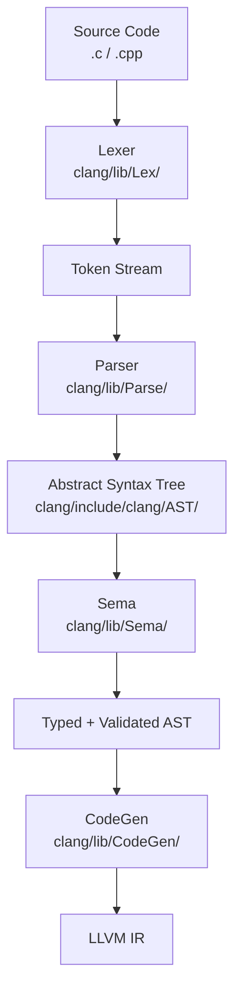
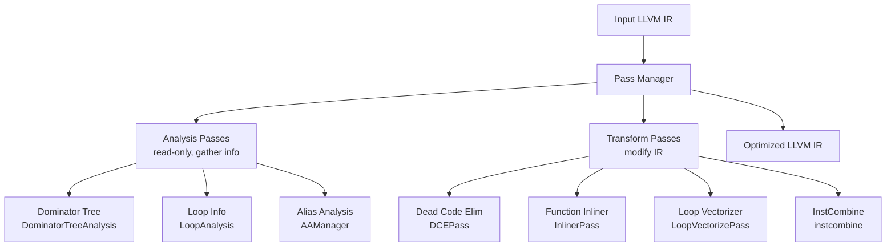

# LLVM Compiler Infrastructure In The Mind

## Understanding LLVM Before Code

> This isn't just a guide to using LLVM. It's an effort to understand how modern compilers think.

LLVM is a collection of modular and reusable compiler and toolchain technologies that has revolutionized how we build compilers. Unlike traditional monolithic compilers, LLVM separates concerns through a carefully designed intermediate representation (IR) that serves as a universal language between frontends and backends.

Understanding LLVM means understanding the architecture of modern compilation: how source code transforms through multiple representations, how optimizations preserve semantics while improving performance, and how machine-independent code generation enables portability.

**LLVM powers the future of compilation. Let's understand how it works.**

---
id: ch1
title: Chapter 1 — Introduction to LLVM
fileRecommendations:
  docs:
    - path: llvm/docs/LangRef.rst
      description: LLVM Language Reference Manual
    - path: llvm/docs/WritingAnLLVMPass.rst
      description: How to write LLVM passes
    - path: llvm/docs/CodeGenerator.rst
      description: LLVM Code Generator reference
  source:
    - path: llvm/include/llvm/IR/Value.h
      description: Base class for all LLVM IR values
    - path: llvm/include/llvm/IR/Instruction.h
      description: LLVM IR instruction base class
    - path: llvm/include/llvm/IR/Function.h
      description: LLVM IR function representation
    - path: llvm/lib/IR/Verifier.cpp
      description: IR validity checking — learn the rules here
---

## Chapter 1 — Introduction to LLVM

### The Philosophy: Separation of Concerns Through IR

LLVM's revolutionary insight was to create a universal intermediate representation that completely separates:

- **Frontend concerns**: Parsing, semantic analysis, language-specific optimizations
- **Middle-end concerns**: Target-independent optimizations
- **Backend concerns**: Code generation, register allocation, instruction scheduling

This separation enables:

- **Multiple frontends** → Single IR → Multiple backends
- **Reusable optimization infrastructure**
- **Language-agnostic tooling**
- **Incremental compilation and JIT**

**The Three-Phase Architecture:**

```
Source Code
    ↓
Frontend (Clang, Swift, Rust)
    ↓
LLVM IR (SSA Form)
    ↓
Optimizer (opt)
    ↓
Optimized IR
    ↓
Backend (x86, ARM, RISC-V)
    ↓
Machine Code
```

### Key Concepts Deep Dive

**1. LLVM IR: The Universal Language**

LLVM IR is:

- **Platform-independent**: Abstracts away CPU details
- **Strongly typed**: Every value has a specific type
- **SSA-based**: Static Single Assignment form (each variable assigned once)
- **Three forms**: Human-readable (.ll), bitcode (.bc), in-memory

**Example IR - Simple Addition:**

```llvm
define i32 @add(i32 %a, i32 %b) {
entry:
  %result = add nsw i32 %a, %b
  ret i32 %result
}
```

**IR Properties:**

- `i32`: 32-bit integer type
- `%a, %b`: Virtual registers in SSA form
- `nsw`: "No Signed Wrap" - enables optimizations
- Every instruction produces a new SSA value

**2. Frontends: Language to IR Translation**

**Clang (C/C++/Objective-C):**

- Lexer → Tokens
- Parser → AST (Abstract Syntax Tree)
- Sema → Semantic Analysis
- CodeGen → LLVM IR

**Key Frontend Responsibilities:**

- Type checking and semantic validation
- Symbol table management
- Template instantiation (C++)
- Debug information generation

**3. Optimizers: Transformation Passes**

LLVM optimizations are organized as **passes**:

- **Analysis passes**: Gather information (e.g., dominator tree)
- **Transform passes**: Modify IR (e.g., dead code elimination)
- **Utility passes**: Helper functionality

**Pass Categories:**

- **Scalar optimizations**: Constant folding, dead code elimination
- **Loop optimizations**: Loop unrolling, vectorization
- **Interprocedural**: Inlining, devirtualization
- **Link-time**: Whole-program optimization

**4. Backends: IR to Machine Code**

Backend phases:

- **Instruction Selection**: IR → Machine IR (SelectionDAG or FastISel)
- **Instruction Scheduling**: Reorder for performance
- **Register Allocation**: Assign virtual registers to physical registers
- **Code Emission**: Generate object file

### Study Files and Architecture

**Essential Files to Study (In Order):**

**Week 1-2: IR Fundamentals**

1. [llvm/include/llvm/IR/Type.h](llvm/include/llvm/IR/Type.h) - Type system
2. [llvm/include/llvm/IR/Value.h](llvm/include/llvm/IR/Value.h) - Base class for all values
3. [llvm/include/llvm/IR/Instruction.h](llvm/include/llvm/IR/Instruction.h) - Instructions
4. [llvm/include/llvm/IR/BasicBlock.h](llvm/include/llvm/IR/BasicBlock.h) - Basic blocks
5. [llvm/include/llvm/IR/Function.h](llvm/include/llvm/IR/Function.h) - Functions

**Week 3-4: Core IR Implementation**

1. [llvm/lib/IR/Type.cpp](llvm/lib/IR/Type.cpp) - Type implementation
2. [llvm/lib/IR/Instructions.cpp](llvm/lib/IR/Instructions.cpp) - Instruction details
3. [llvm/lib/IR/Verifier.cpp](llvm/lib/IR/Verifier.cpp) - IR validation (learn IR rules!)

**Month 2: Analysis**

1. [llvm/include/llvm/Analysis/CFG.h](llvm/include/llvm/Analysis/CFG.h) - Control flow graph
2. [llvm/lib/Analysis/ScalarEvolution.cpp](llvm/lib/Analysis/ScalarEvolution.cpp) - Loop analysis
3. [llvm/lib/Analysis/MemorySSA.cpp](llvm/lib/Analysis/MemorySSA.cpp) - Memory dependencies

**Month 3: Transformations**

1. [llvm/lib/Transforms/Scalar/DCE.cpp](llvm/lib/Transforms/Scalar/DCE.cpp) - Dead code elimination
2. [llvm/lib/Transforms/Scalar/SCCP.cpp](llvm/lib/Transforms/Scalar/SCCP.cpp) - Constant propagation
3. [llvm/lib/Transforms/Utils/Mem2Reg.cpp](llvm/lib/Transforms/Utils/Mem2Reg.cpp) - Promote allocas to registers

---
id: ch2
title: Chapter 2 — LLVM IR and Code Generation
fileRecommendations:
  docs:
    - path: llvm/docs/LangRef.rst
      description: Complete LLVM IR language reference
  source:
    - path: llvm/lib/IR/Instructions.cpp
      description: All IR instruction types (~4,000 lines)
    - path: llvm/lib/IR/Verifier.cpp
      description: IR validity checking — the rules of valid IR
    - path: llvm/lib/CodeGen/SelectionDAG/
      description: Instruction selection via SelectionDAG
    - path: llvm/lib/Target/X86/X86ISelLowering.cpp
      description: x86 IR lowering (~50,000 lines!)
---

## Chapter 2 — LLVM IR and Code Generation

The LLVM Intermediate Representation (IR) is a low-level programming language similar to assembly, but with higher-level type information and a consistent three-address code representation. It serves as the universal language that enables LLVM's modular architecture.

### Understanding LLVM IR - Deep Dive

**Why SSA (Static Single Assignment)?**

SSA form is fundamental to LLVM IR. Each variable is assigned exactly once, which enables:

- **Simpler dataflow analysis**: Definitions and uses are explicit
- **Efficient optimizations**: Dead code elimination, constant propagation
- **Natural representation**: Matches how compilers think about values

**Non-SSA vs SSA Example:**

```c
// Original C code
int x = 1;
if (condition) {
  x = 2;
}
x = x + 1;
```

**SSA IR (actual LLVM) with PHI nodes:**

```llvm
define i32 @example(i1 %condition) {
entry:
  br i1 %condition, label %then, label %merge

then:
  br label %merge

merge:
  %x = phi i32 [ 1, %entry ], [ 2, %then ]  ; SSA merge point
  %result = add i32 %x, 1
  ret i32 %result
}
```

**PHI Nodes Explained:**

- `phi` instruction selects value based on predecessor block
- Format: `phi type [ value1, %pred1 ], [ value2, %pred2 ]`
- Enables SSA while representing control flow merges

### The Complete LLVM IR Type System

**Primitive Types:**

```llvm
i1      ; 1-bit integer (boolean)
i8      ; 8-bit integer (char)
i32     ; 32-bit integer (int)
i64     ; 64-bit integer (long)
float   ; 32-bit floating point
double  ; 64-bit floating point
```

**Derived Types:**

```llvm
i32*                    ; Pointer to i32
[10 x i32]             ; Array of 10 i32s
<4 x float>            ; Vector of 4 floats (SIMD)
{i32, i8, i32*}        ; Structure type
i32 (i32, i32)         ; Function type
```

### Essential LLVM IR Instructions

**Arithmetic, Memory, and Control Flow:**

```llvm
%sum = add nsw i32 %a, %b       ; Addition (no signed wrap)
%ptr = alloca i32               ; Allocate stack memory
%val = load i32, i32* %ptr      ; Load from memory
store i32 42, i32* %ptr         ; Store to memory
br i1 %cond, label %t, label %f ; Conditional branch
%result = call i32 @foo(i32 %x) ; Function call
%cmp = icmp slt i32 %a, %b      ; Signed less-than compare
```

### Complete Example: Factorial Function

```llvm
define i32 @factorial(i32 %n) {
entry:
  %cmp = icmp sle i32 %n, 1
  br i1 %cmp, label %base_case, label %recursive_case

base_case:
  ret i32 1

recursive_case:
  %n_minus_1 = sub i32 %n, 1
  %rec_result = call i32 @factorial(i32 %n_minus_1)
  %result = mul i32 %n, %rec_result
  ret i32 %result
}
```

### IR Generation Pipeline (Clang)

**1. Lexer** ([clang/lib/Lex/](clang/lib/Lex/)): `"int x = 42;"` → tokens

**2. Parser** ([clang/lib/Parse/](clang/lib/Parse/)): tokens → AST `VarDecl(type=int, name="x", init=IntegerLiteral(42))`

**3. Sema** ([clang/lib/Sema/](clang/lib/Sema/)): AST → validated AST with types

**4. CodeGen** ([clang/lib/CodeGen/](clang/lib/CodeGen/)): AST → LLVM IR

Key CodeGen files:
- [clang/lib/CodeGen/CodeGenModule.cpp](clang/lib/CodeGen/CodeGenModule.cpp) - Module-level IR generation
- [clang/lib/CodeGen/CodeGenFunction.cpp](clang/lib/CodeGen/CodeGenFunction.cpp) - Function-level IR generation
- [clang/lib/CodeGen/CGExpr.cpp](clang/lib/CodeGen/CGExpr.cpp) - Expression code generation

### Study Files for IR and CodeGen

**IR Core ([llvm/lib/IR/](llvm/lib/IR/)):**

- [llvm/lib/IR/Type.cpp](llvm/lib/IR/Type.cpp) (~860 lines) - Type system implementation
- [llvm/lib/IR/Value.cpp](llvm/lib/IR/Value.cpp) (~1,300 lines) - Base value class
- [llvm/lib/IR/Instructions.cpp](llvm/lib/IR/Instructions.cpp) (~4,000 lines) - All instruction types
- [llvm/lib/IR/BasicBlock.cpp](llvm/lib/IR/BasicBlock.cpp) (~1,200 lines) - Basic block implementation
- [llvm/lib/IR/Verifier.cpp](llvm/lib/IR/Verifier.cpp) (~7,200 lines) - IR validity checking

**Target-Specific ([llvm/lib/Target/X86/](llvm/lib/Target/X86/)):**

- [llvm/lib/Target/X86/X86ISelLowering.cpp](llvm/lib/Target/X86/X86ISelLowering.cpp) (~50,000 lines!) - Lower IR to x86
- [llvm/lib/Target/X86/X86InstrInfo.td](llvm/lib/Target/X86/X86InstrInfo.td) - x86 instruction descriptions (TableGen)
- [llvm/lib/Target/X86/X86RegisterInfo.td](llvm/lib/Target/X86/X86RegisterInfo.td) - x86 register descriptions

---
id: ch3
title: Chapter 3 — Clang Frontend
fileRecommendations:
  docs:
    - path: clang/docs/IntroductionToTheClangAST.rst
      description: Introduction to the Clang AST
    - path: clang/docs/InternalsManual.rst
      description: Clang internals manual
  source:
    - path: clang/include/clang/AST/Decl.h
      description: Declaration AST nodes
    - path: clang/include/clang/AST/Expr.h
      description: Expression AST nodes
    - path: clang/lib/Sema/SemaDecl.cpp
      description: Semantic analysis for declarations
    - path: clang/lib/CodeGen/CodeGenModule.cpp
      description: Module-level LLVM IR generation
    - path: clang/lib/Parse/ParseDecl.cpp
      description: Parser for declarations
---

## Chapter 3 — Clang Frontend

Clang is the C/C++/Objective-C compiler frontend for LLVM. It parses source code, performs semantic analysis, and generates LLVM IR. Unlike GCC, Clang was designed from the ground up to be a library—enabling tools like clang-tidy, clang-format, and clangd to reuse the same parsing infrastructure.



```chapter-graph
clang/lib/Lex/Lexer.cpp -> clang/lib/Parse/Parser.cpp : tokens → AST nodes
clang/lib/Parse/Parser.cpp -> clang/include/clang/AST/Decl.h : creates Decl nodes
clang/lib/Parse/Parser.cpp -> clang/include/clang/AST/Expr.h : creates Expr nodes
clang/lib/Sema/SemaDecl.cpp -> clang/include/clang/AST/Decl.h : validates declarations
clang/lib/CodeGen/CodeGenFunction.cpp -> clang/lib/CodeGen/CGExpr.cpp : delegates expression codegen
clang/lib/CodeGen/CodeGenModule.cpp -> clang/lib/CodeGen/CodeGenFunction.cpp : function IR generation
```

### The Clang AST: A Typed Syntax Tree

Unlike a simple parse tree, Clang's AST carries full type information and represents the semantics of the program, not just its syntax.

**Core AST node families:**

- **Decl**: Declarations — `VarDecl`, `FunctionDecl`, `RecordDecl` (struct/class)
- **Stmt**: Statements — `IfStmt`, `ForStmt`, `CompoundStmt`
- **Expr**: Expressions — `BinaryOperator`, `CallExpr`, `DeclRefExpr`
- **Type**: Types — `BuiltinType`, `PointerType`, `RecordType`

**Example: `int x = a + b;` in the AST:**

```
DeclStmt
└── VarDecl 'x' 'int'
    └── BinaryOperator '+' 'int'
        ├── ImplicitCastExpr 'int'
        │   └── DeclRefExpr 'a' 'int'
        └── ImplicitCastExpr 'int'
            └── DeclRefExpr 'b' 'int'
```

You can dump any C file's AST with:

```bash
clang -Xclang -ast-dump -fsyntax-only file.c
```

Key AST header files:
- [clang/include/clang/AST/Decl.h](clang/include/clang/AST/Decl.h) — Declaration nodes
- [clang/include/clang/AST/Expr.h](clang/include/clang/AST/Expr.h) — Expression nodes
- [clang/include/clang/AST/Stmt.h](clang/include/clang/AST/Stmt.h) — Statement nodes
- [clang/include/clang/AST/Type.h](clang/include/clang/AST/Type.h) — Type representations

### Parsing: From Tokens to AST

The Clang parser is a hand-written recursive descent parser. Each grammar rule maps to a `ParseXxx()` method in the `Parser` class.

**Parser structure:**

```cpp
// clang/lib/Parse/Parser.cpp
class Parser {
    Preprocessor &PP;   // Token source
    Sema &Actions;      // Semantic action callbacks

    // Top-level parsing
    DeclGroupPtrTy ParseTopLevelDecl();
    StmtResult ParseStatement();
    ExprResult ParseExpression();
    ExprResult ParseAssignmentExpression();
    ExprResult ParseCastExpression(bool isUnaryExpression);
};
```

The parser calls Sema actions as it builds the tree — type checking happens simultaneously with parsing, not in a separate pass.

Key parser files:
- [clang/lib/Parse/ParseDecl.cpp](clang/lib/Parse/ParseDecl.cpp) — Declaration parsing
- [clang/lib/Parse/ParseExpr.cpp](clang/lib/Parse/ParseExpr.cpp) — Expression parsing
- [clang/lib/Parse/ParseStmt.cpp](clang/lib/Parse/ParseStmt.cpp) — Statement parsing

### Semantic Analysis: Type Checking and Validation

Sema is the largest component of Clang (~100k lines). It handles:

- **Name lookup**: Resolving identifiers to their declarations
- **Type checking**: Ensuring operations are valid for their types
- **Implicit conversions**: `int` → `long`, lvalue → rvalue
- **Template instantiation**: Expanding C++ templates
- **Overload resolution**: Selecting the right function overload

```cpp
// clang/lib/Sema/SemaExpr.cpp (simplified)
ExprResult Sema::ActOnBinaryOp(Scope *S, SourceLocation OpLoc,
                                 tok::TokenKind Kind, Expr *LHS, Expr *RHS) {
    // Check operand types
    QualType LType = LHS->getType();
    QualType RType = RHS->getType();

    // Perform usual arithmetic conversions
    QualType ResultType = UsualArithmeticConversions(LHS, RHS);

    // Create the AST node
    return BinaryOperator::Create(Context, LHS, RHS, Opc, ResultType, ...);
}
```

Key Sema files:
- [clang/lib/Sema/SemaDecl.cpp](clang/lib/Sema/SemaDecl.cpp) — Declaration semantics
- [clang/lib/Sema/SemaExpr.cpp](clang/lib/Sema/SemaExpr.cpp) — Expression type checking
- [clang/lib/Sema/SemaOverload.cpp](clang/lib/Sema/SemaOverload.cpp) — C++ overload resolution

### IR Generation: AST to LLVM IR

CodeGen traverses the typed AST and emits LLVM IR using `IRBuilder`. Each AST node type has a corresponding `EmitXxx()` method.

```cpp
// clang/lib/CodeGen/CGExpr.cpp (simplified)
llvm::Value *CodeGenFunction::EmitBinaryOp(const BinaryOperator *E) {
    llvm::Value *LHS = EmitScalarExpr(E->getLHS());
    llvm::Value *RHS = EmitScalarExpr(E->getRHS());

    switch (E->getOpcode()) {
    case BO_Add:
        return Builder.CreateAdd(LHS, RHS, "add");
    case BO_Mul:
        return Builder.CreateMul(LHS, RHS, "mul");
    // ...
    }
}
```

Key CodeGen files:
- [clang/lib/CodeGen/CodeGenModule.cpp](clang/lib/CodeGen/CodeGenModule.cpp) — Module-level IR (globals, functions)
- [clang/lib/CodeGen/CodeGenFunction.cpp](clang/lib/CodeGen/CodeGenFunction.cpp) — Per-function IR generation
- [clang/lib/CodeGen/CGExpr.cpp](clang/lib/CodeGen/CGExpr.cpp) — Expression code generation
- [clang/lib/CodeGen/CGStmt.cpp](clang/lib/CodeGen/CGStmt.cpp) — Statement code generation
- [clang/lib/CodeGen/CGCall.cpp](clang/lib/CodeGen/CGCall.cpp) — Function call lowering

---
id: ch4
title: Chapter 4 — Optimization Passes
fileRecommendations:
  docs:
    - path: llvm/docs/WritingAnLLVMPass.rst
      description: How to write an LLVM optimization pass
    - path: llvm/docs/Passes.rst
      description: Built-in LLVM passes reference
  source:
    - path: llvm/lib/Transforms/Scalar/DCE.cpp
      description: Dead Code Elimination — simplest transform pass
    - path: llvm/lib/Transforms/Scalar/SCCP.cpp
      description: Sparse Conditional Constant Propagation
    - path: llvm/lib/Transforms/Utils/Mem2Reg.cpp
      description: Promote stack allocas to SSA registers
    - path: llvm/lib/Transforms/InstCombine/
      description: Instruction combining (~50,000 lines of peepholes)
    - path: llvm/include/llvm/IR/PassManager.h
      description: New Pass Manager infrastructure
---

## Chapter 4 — Optimization Passes

LLVM's optimizer consists of a series of passes that transform IR to improve code quality. The pass framework is one of LLVM's most powerful features—it makes optimizations composable, testable, and reusable.



```chapter-graph
llvm/include/llvm/IR/PassManager.h -> llvm/lib/Transforms/Scalar/DCE.cpp : pass interface → impl
llvm/include/llvm/IR/Dominators.h -> llvm/lib/Transforms/Scalar/SCCP.cpp : dominator info feeds SCCP
llvm/lib/Transforms/Utils/Mem2Reg.cpp -> llvm/include/llvm/IR/Dominators.h : requires dominator tree
llvm/lib/Transforms/Scalar/SCCP.cpp -> llvm/include/llvm/IR/InstVisitor.h : visits all instructions
llvm/lib/Transforms/InstCombine/ -> llvm/include/llvm/IR/PatternMatch.h : pattern matching IR
```

### The Pass Infrastructure

LLVM has two pass managers: the **Legacy Pass Manager** (LPM) and the newer **New Pass Manager** (NPM, default since LLVM 13).

**New Pass Manager (NPM) — how a pass is structured:**

```cpp
// Define a pass
struct MyPass : PassInfoMixin<MyPass> {
    PreservedAnalyses run(Function &F, FunctionAnalysisManager &AM) {
        // Use analysis results
        auto &DT = AM.getResult<DominatorTreeAnalysis>(F);
        auto &LI = AM.getResult<LoopAnalysis>(F);

        bool Changed = false;
        for (auto &BB : F) {
            for (auto &I : BB) {
                // Transform instruction
                Changed |= tryOptimize(I);
            }
        }

        return Changed ? PreservedAnalyses::none()
                      : PreservedAnalyses::all();
    }
};

// Register with the pass pipeline
llvm::PassPluginLibraryInfo getPluginInfo() {
    return {LLVM_PLUGIN_API_VERSION, "MyPass", "v0.1",
            [](PassBuilder &PB) {
                PB.registerPipelineParsingCallback(
                    [](StringRef Name, FunctionPassManager &FPM, ...) {
                        FPM.addPass(MyPass());
                        return true;
                    });
            }};
}
```

Key infrastructure files:
- [llvm/include/llvm/IR/PassManager.h](llvm/include/llvm/IR/PassManager.h) — Pass manager interfaces
- [llvm/include/llvm/Passes/PassBuilder.h](llvm/include/llvm/Passes/PassBuilder.h) — Pipeline construction
- [llvm/include/llvm/IR/InstVisitor.h](llvm/include/llvm/IR/InstVisitor.h) — Visitor pattern for IR traversal

### Key Scalar Optimization Passes

**1. Dead Code Elimination (DCE)**

Removes instructions whose results are never used. The simplest transform pass—great for learning the pass framework.

File: [llvm/lib/Transforms/Scalar/DCE.cpp](llvm/lib/Transforms/Scalar/DCE.cpp)

```cpp
// DCE core logic (simplified)
bool eliminateDeadCode(Function &F) {
    SmallSetVector<Instruction *, 16> WorkList;
    bool MadeChange = false;

    for (auto &I : instructions(F))
        if (isInstructionTriviallyDead(&I))
            WorkList.insert(&I);

    while (!WorkList.empty()) {
        Instruction *I = WorkList.pop_back_val();
        // Add operands to worklist if they become dead
        for (Use &U : I->operands())
            if (auto *Op = dyn_cast<Instruction>(U))
                if (Op->use_empty())
                    WorkList.insert(Op);
        I->eraseFromParent();
        MadeChange = true;
    }
    return MadeChange;
}
```

**2. Sparse Conditional Constant Propagation (SCCP)**

Propagates constant values through the IR, eliminating conditional branches when the condition is known at compile time.

File: [llvm/lib/Transforms/Scalar/SCCP.cpp](llvm/lib/Transforms/Scalar/SCCP.cpp)

```llvm
; Before SCCP
%x = add i32 5, 3     ; constant: always 8
%cmp = icmp slt i32 %x, 10
br i1 %cmp, label %true, label %false

; After SCCP
br label %true         ; branch folded — %x = 8, 8 < 10 always true
```

**3. Mem2Reg: The Most Important Pass**

Promotes `alloca` (stack) variables to SSA virtual registers. This is the pass that creates PHI nodes and is the foundation for most other optimizations.

File: [llvm/lib/Transforms/Utils/Mem2Reg.cpp](llvm/lib/Transforms/Utils/Mem2Reg.cpp)

```llvm
; Before Mem2Reg (alloca pattern from Clang CodeGen)
%x = alloca i32
store i32 5, i32* %x
%val = load i32, i32* %x  ; load from stack
%result = add i32 %val, 1

; After Mem2Reg (stack → register, PHI nodes inserted at merge points)
%result = add i32 5, 1   ; direct use of constant
```

**4. InstCombine: Peephole Optimizations**

A large collection (~50,000 lines) of algebraic simplifications and canonicalizations.

Directory: [llvm/lib/Transforms/InstCombine/](llvm/lib/Transforms/InstCombine/)

Examples of what InstCombine does:

```llvm
; Strength reduction
%r = mul i32 %x, 8    → %r = shl i32 %x, 3  (multiply by power of 2 → shift)

; Algebraic identity
%r = add i32 %x, 0    → %r = %x               (x + 0 = x)

; Comparison folding
%r = icmp slt i32 %x, %x → %r = false         (x < x always false)
```

### Loop Optimization Passes

Loops are the highest-leverage optimization targets since they execute repeatedly.

**Key loop passes:**

1. **Loop Unrolling** ([llvm/lib/Transforms/Scalar/LoopUnrollPass.cpp](llvm/lib/Transforms/Scalar/LoopUnrollPass.cpp)) — replicate loop body to reduce branch overhead
2. **Loop Vectorization** ([llvm/lib/Transforms/Vectorize/LoopVectorize.cpp](llvm/lib/Transforms/Vectorize/LoopVectorize.cpp)) — auto-vectorize with SIMD instructions
3. **Loop Interchange** — swap loop nesting for cache efficiency
4. **Loop Fusion** — combine adjacent loops with the same bounds

All loop passes require **LoopAnalysis** and **DominatorTreeAnalysis** as prerequisites.

### Running and Inspecting Passes

```bash
# Run specific passes
opt -passes="mem2reg,instcombine,dce" input.ll -S -o output.ll

# Visualize the CFG before and after
opt -passes="dot-cfg" input.ll && dot -Tpng .foo.dot -o foo.png

# See what passes -O2 runs
opt -O2 -debug-pass-manager input.ll 2>&1 | grep "Running pass"
```

---

## References

- [LLVM Language Reference](https://llvm.org/docs/LangRef.html) — Complete IR specification
- [Writing an LLVM Pass](https://llvm.org/docs/WritingAnLLVMPass.html) — Official pass writing guide
- [LLVM Kaleidoscope Tutorial](https://llvm.org/docs/tutorial/) — Build a JIT compiler from scratch
- [LLVM Programmer's Manual](https://llvm.org/docs/ProgrammersManual.html) — Core API guide
- [Clang Internals Manual](https://clang.llvm.org/docs/InternalsManual.html) — Clang architecture deep dive
