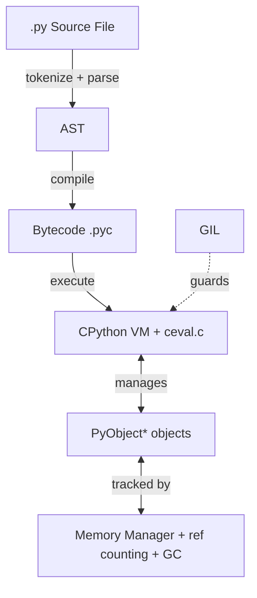
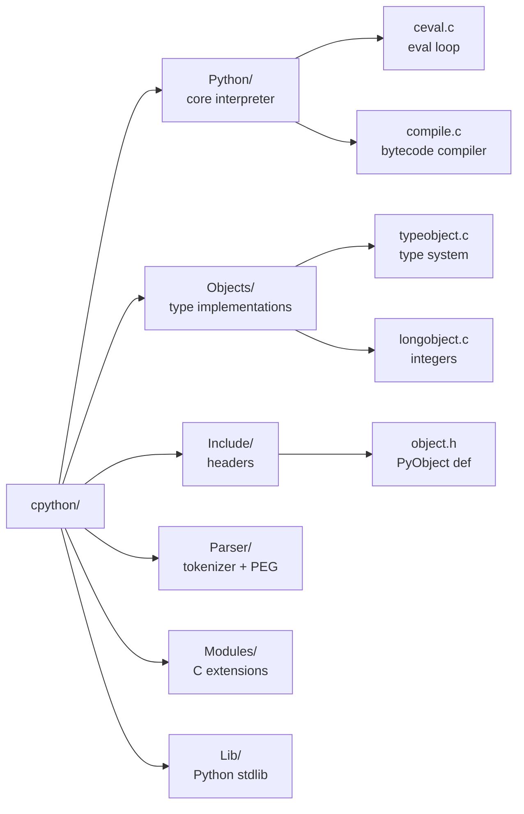
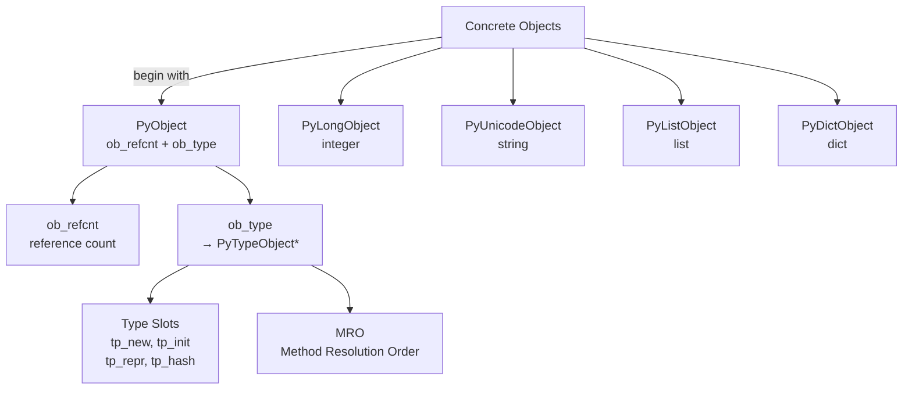
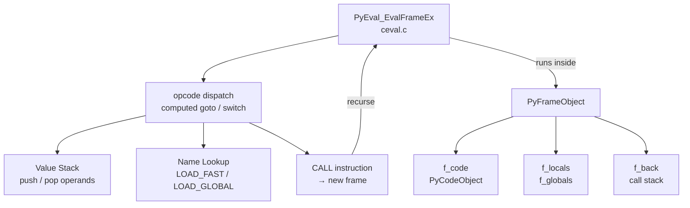
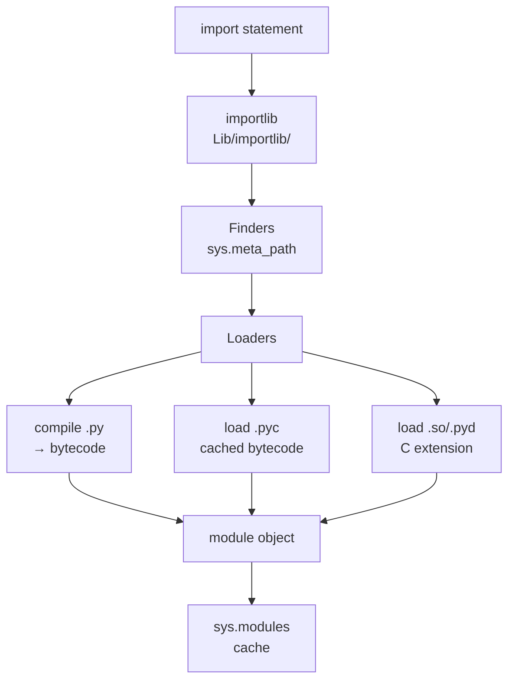
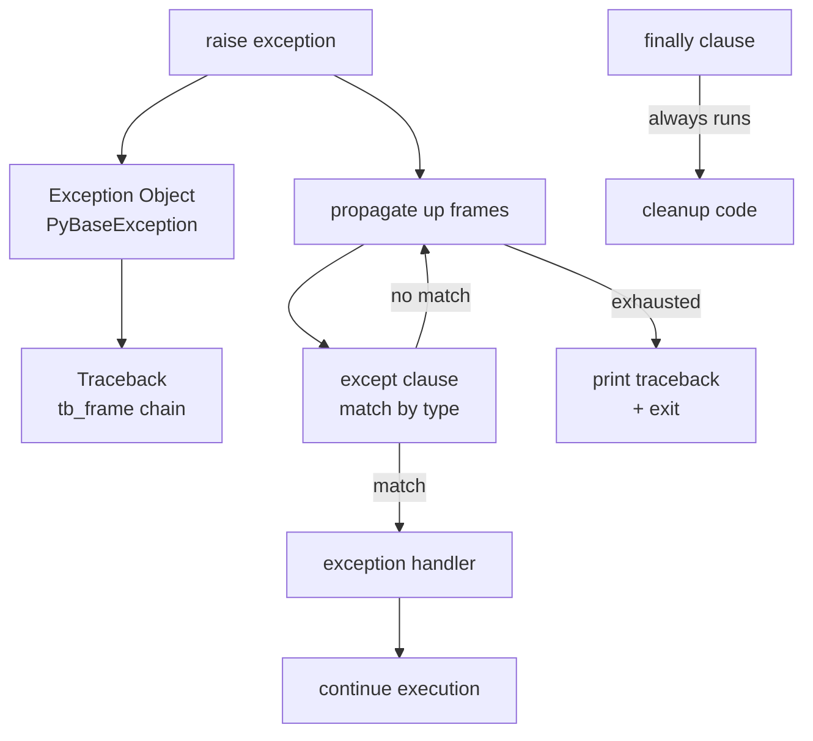
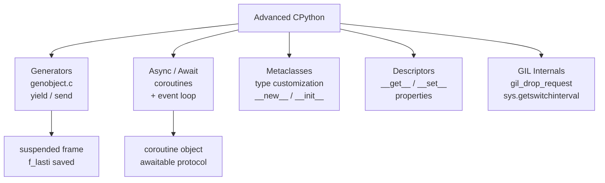

# CPython In The Mind

## Understanding CPython Before Code

> This isn't a guide to writing Python code. It's an effort to understand how CPython thinks.

CPython is the reference implementation of Python, written in C. It compiles Python source code to bytecode and executes it on a virtual machine. Understanding CPython's internals reveals how Python's elegant syntax translates into efficient execution, how objects are managed in memory, and how the interpreter orchestrates program execution.

This guide is for anyone who wants to build a mental model of how CPython works—before diving deep into the source code. Whether you're exploring Python internals for the first time or returning with new questions, the focus here is on **behavior, not syntax**.

**CPython runs Python. Let's understand how it runs.**

---
id: learning-path
title: Learning Path for CPython Exploration
---

## Learning Path for CPython Exploration

This guide follows a structured learning path designed to master Python internals:

### Beginner Path (Months 1-3)

1. **Python Basics**: Solid understanding of Python language features
2. **C Programming**: Comfortable reading C code
3. **Bytecode Exploration**: Use `dis` module to see bytecode
4. **Simple Tracing**: Trace Python execution with sys.settrace

**Practical Start:**

```python
import dis

def factorial(n):
    if n <= 1:
        return 1
    return n * factorial(n - 1)

# See the bytecode
dis.dis(factorial)
```

### Intermediate Path (Months 4-6)

1. **Object Model**: Study PyObject and type system
2. **Memory Management**: Understand reference counting and GC
3. **Built-in Types**: Deep dive into list, dict, str implementations
4. **Extension Modules**: Write C extensions for Python

**Key Projects:**

- Write a simple C extension module
- Implement a custom Python type in C
- Study how built-in functions work

### Advanced Path (Months 7-12)

1. **Evaluation Loop**: Master ceval.c and bytecode execution
2. **Compiler Pipeline**: Study compilation from AST to bytecode
3. **GIL Internals**: Understand GIL acquisition and release
4. **Advanced Features**: Generators, coroutines, metaclasses

**Advanced Projects:**

- Modify CPython to add a custom bytecode
- Implement a tracing JIT for specific operations
- Profile and optimize CPython performance

### Expert Path (Year 2+)

1. **CPython Contribution**: Submit patches to CPython
2. **Performance Optimization**: Profile and optimize critical paths
3. **Alternative Implementations**: Study PyPy, Cython
4. **Research**: Implement PEPs or research papers

---
id: ch1
title: Chapter 1 — Understanding CPython Before Code
fileRecommendations:
  docs:
    - path: Doc/c-api/
      description: Python C API reference
    - path: Doc/extending/
      description: Extending Python with C
    - path: Doc/glossary.rst
      description: GIL and core term definitions
    - path: Doc/c-api/memory.rst
      description: Memory management overview
  source:
    - path: Python/ceval.c
      description: Main evaluation loop — the heart of CPython
    - path: Include/object.h
      description: PyObject struct — foundation of all Python objects
    - path: Modules/gcmodule.c
      description: Cyclic garbage collector
---

## Chapter 1 — Understanding CPython Before Code



### CPython Is Not Just a Compiler. It Is an Interpreter.

CPython is both a compiler and an interpreter. It compiles Python source code to bytecode, then executes that bytecode on a stack-based virtual machine. Understanding this dual nature reveals how Python achieves its balance between high-level expressiveness and runtime efficiency. The compilation phase handles syntax analysis and optimization, while the interpreter handles execution, memory management, and dynamic behavior.

### Everything Is an Object: The Foundation of Python

In Python, everything is an object—integers, functions, classes, modules, even types themselves. This uniform object model simplifies the language design and enables powerful features like introspection, dynamic typing, and metaprogramming. Understanding this principle reveals how CPython manages memory, implements polymorphism, and provides a consistent interface across all language constructs.

Key files: [Include/object.h](Include/object.h) defines `PyObject`, and [Objects/typeobject.c](Objects/typeobject.c) implements the type system.

### The Global Interpreter Lock (GIL): Concurrency in CPython

The Global Interpreter Lock (GIL) is a mutex that protects access to Python objects, preventing multiple native threads from executing Python bytecodes at once. While this simplifies memory management and makes CPython thread-safe, it also means that CPU-bound Python code cannot fully utilize multiple cores. Understanding the GIL reveals the trade-offs in CPython's design and why it exists despite its limitations.

See [Doc/c-api/init.rst](Doc/c-api/init.rst) for interpreter initialization and the GIL lifecycle.

### Memory Management: Reference Counting and Garbage Collection

CPython uses a combination of reference counting and a cyclic garbage collector for memory management. Every object maintains a reference count, and when it reaches zero, the object is immediately deallocated. However, reference counting alone cannot handle circular references, so CPython includes a garbage collector that detects and collects cycles. Understanding this dual approach reveals how CPython balances performance with correctness.

See [Doc/c-api/gcsupport.rst](Doc/c-api/gcsupport.rst) for garbage collector support documentation.

---
id: ch2
title: Chapter 2 — Source Code Structure
fileRecommendations:
  docs:
    - path: Doc/
      description: Official Python documentation source
    - path: InternalDocs/
      description: Internal implementation notes
    - path: Doc/c-api/veryhigh.rst
      description: High-level compilation API
  source:
    - path: Python/ceval.c
      description: Main evaluation loop (~6,000 lines)
    - path: Python/compile.c
      description: Bytecode compiler — AST to bytecode
    - path: Objects/typeobject.c
      description: Type system (~8,000 lines)
    - path: Include/object.h
      description: PyObject and PyTypeObject definitions
    - path: Parser/tokenizer.c
      description: Lexical analysis — source to tokens
---

## Chapter 2 — Source Code Structure



```chapter-graph
Parser/tokenizer.c -> Parser/parser.c : tokens → AST
Parser/parser.c -> Python/ast.c : parse tree → AST
Python/ast.c -> Python/compile.c : AST → bytecode
Python/compile.c -> Python/ceval.c : bytecode → execution
Python/ceval.c -> Include/opcode.h : dispatch opcodes
Python/frameobject.c -> Python/ceval.c : execution context
```

### A Walk Through the CPython Source: Understanding Its Organization

The CPython source code is organized into clear directories, each serving a specific purpose. Understanding this structure provides a roadmap for exploring the interpreter's internals.

**Detailed Directory Structure:**

```
cpython/
├── Python/                    # Core interpreter (~100k lines)
│   ├── ceval.c               # Main evaluation loop (~6,000 lines!)
│   ├── compile.c             # Bytecode compiler (~6,000 lines)
│   ├── ast.c                 # AST manipulation
│   ├── import.c              # Import system
│   ├── bltinmodule.c         # Built-in functions
│   ├── pystate.c             # Interpreter state
│   └── frame.c               # Frame objects
├── Objects/                   # Object implementations (~150k lines)
│   ├── object.c              # Base PyObject
│   ├── typeobject.c          # Type system (~8,000 lines)
│   ├── longobject.c          # Integer implementation (~5,000 lines)
│   ├── unicodeobject.c       # String implementation (~15,000 lines!)
│   ├── listobject.c          # List implementation (~3,000 lines)
│   ├── dictobject.c          # Dictionary (~6,000 lines)
│   ├── setobject.c           # Set implementation
│   ├── funcobject.c          # Function objects
│   ├── classobject.c         # Class/method objects
│   ├── genobject.c           # Generator objects
│   └── descrobject.c         # Descriptors (properties, etc.)
├── Include/                   # Header files
│   ├── Python.h              # Main header (includes everything)
│   ├── object.h              # PyObject definition
│   ├── cpython/              # CPython-specific (not stable API)
│   │   ├── object.h          # Internal object details
│   │   └── pystate.h         # Interpreter state internals
│   ├── internal/             # Internal CPython APIs
│   │   ├── pycore_*.h        # Core internal headers
│   │   └── pycore_gc.h       # GC internals
│   ├── methodobject.h        # Method objects
│   ├── funcobject.h          # Function objects
│   └── code.h                # Code objects
├── Parser/                    # Parsing (~30k lines)
│   ├── tokenizer.c           # Lexical analysis
│   ├── parser.c              # PEG parser (new in 3.9)
│   ├── pegen/                # PEG parser generator
│   └── token.c               # Token definitions
├── Modules/                   # C extension modules
│   ├── _abc.c                # ABC (abstract base classes)
│   ├── gcmodule.c            # Garbage collector (~2,000 lines)
│   ├── _threadmodule.c       # Threading primitives
│   ├── _io/                  # I/O implementation
│   ├── _json.c               # JSON parser
│   └── mathmodule.c          # Math functions
├── Lib/                       # Pure Python stdlib
│   ├── collections/          # Collections module
│   ├── asyncio/              # Async I/O
│   ├── importlib/            # Import implementation
│   ├── dis.py                # Bytecode disassembler
│   └── ast.py                # AST utilities
├── Programs/                  # Main programs
│   └── python.c              # Python executable entry point
└── Doc/                       # Documentation source
    ├── c-api/                # C API documentation
    ├── library/              # Standard library docs
    └── reference/            # Language reference
```

**Key File Statistics:**

- Total C code: ~500,000 lines
- Core interpreter ([Python/](Python/)): ~100,000 lines
- Object implementations ([Objects/](Objects/)): ~150,000 lines
- Standard library ([Lib/](Lib/)): ~500,000+ lines of Python

### The Compilation Pipeline: From Source to Bytecode

CPython's compilation process transforms Python source code into bytecode through several stages: tokenization, parsing, AST generation, and bytecode generation. Understanding this pipeline reveals how Python's syntax is analyzed and how optimizations are applied before execution.

Key files in the pipeline:
- [Parser/tokenizer.c](Parser/tokenizer.c) — Tokenizes Python source code
- [Parser/parser.c](Parser/parser.c) — Parses tokens into abstract syntax trees
- [Python/ast.c](Python/ast.c) — AST manipulation and validation
- [Python/compile.c](Python/compile.c) — Compiles AST to bytecode

### The Execution Model: Bytecode to Results

CPython executes bytecode using a stack-based virtual machine. The main evaluation loop ([Python/ceval.c](Python/ceval.c)) interprets bytecode instructions, manipulating a value stack and maintaining execution frames. Understanding this model reveals how Python's dynamic features—like dynamic attribute access and method resolution—are implemented at runtime.

See [Include/opcode.h](Include/opcode.h) for bytecode instruction definitions and [Python/frameobject.c](Python/frameobject.c) for frame management.

---
id: ch3
title: Chapter 3 — The Object Model
fileRecommendations:
  docs:
    - path: Doc/c-api/object.rst
      description: Object protocol
    - path: Doc/c-api/typeobj.rst
      description: Type objects reference
    - path: Doc/c-api/refcounting.rst
      description: Reference counting API
    - path: Doc/c-api/gcsupport.rst
      description: Garbage collector support
  source:
    - path: Include/object.h
      description: PyObject and PyTypeObject definitions
    - path: Objects/object.c
      description: Base object implementation
    - path: Objects/typeobject.c
      description: Type system (~8,000 lines)
    - path: Modules/gcmodule.c
      description: Cyclic garbage collector
    - path: Objects/abstract.c
      description: Abstract object protocol dispatch
---

## Chapter 3 — The Object Model



```chapter-graph
Include/object.h -> Objects/object.c : PyObject struct → impl
Objects/object.c -> Objects/typeobject.c : base ops → type slots
Include/cpython/object.h -> Include/object.h : internal details extend public API
Objects/abstract.c -> Objects/typeobject.c : protocol dispatch via type slots
Objects/object.c -> Include/cpython/object.h : ob_type → PyTypeObject
Modules/gcmodule.c -> Include/internal/pycore_gc.h : cyclic GC tracks PyObject
```

### PyObject: The Base of Everything

All Python objects in CPython are represented by structures that begin with `PyObject` (or `PyObject_HEAD`). This common header contains the object's type pointer and reference count. This design enables polymorphism: any function that accepts a `PyObject*` can work with any Python object, and the type system determines the correct behavior at runtime.

Key files:
- [Objects/object.c](Objects/object.c) — Base object implementation
- [Include/object.h](Include/object.h) — Object structure definitions
- [Objects/typeobject.c](Objects/typeobject.c) — Type object implementation

### Type Objects: Defining Behavior

In Python, types are themselves objects. The `PyTypeObject` structure defines how objects of a particular type behave: what methods they support, how they're created, how they're compared, and how they're represented as strings. Understanding type objects reveals how Python's dynamic typing and method resolution work.

Key files:
- [Objects/typeobject.c](Objects/typeobject.c) — Type object implementation (~8,000 lines)
- [Include/cpython/object.h](Include/cpython/object.h) — Type object structure internals
- [Objects/abstract.c](Objects/abstract.c) — Abstract object protocol

See [Doc/c-api/typeobj.rst](Doc/c-api/typeobj.rst) for the full type object slot reference.

### Reference Counting: Automatic Memory Management

CPython uses reference counting as its primary memory management mechanism. Every object maintains a count of how many references point to it. When this count reaches zero, the object is immediately deallocated. This provides deterministic memory management but requires careful handling to avoid premature deallocation or leaks.

The macros `Py_INCREF` and `Py_DECREF` in [Objects/object.c](Objects/object.c) and [Include/object.h](Include/object.h) implement reference counting.

### Garbage Collection: Handling Cycles

While reference counting handles most memory management, it cannot detect or break circular references. CPython includes a cyclic garbage collector that periodically scans for unreachable cycles and collects them. Understanding the garbage collector reveals how CPython handles complex object graphs and why some objects may not be immediately deallocated.

Key files:
- [Modules/gcmodule.c](Modules/gcmodule.c) — Garbage collector implementation
- [Include/internal/pycore_gc.h](Include/internal/pycore_gc.h) — GC internal definitions

---
id: ch4
title: Chapter 4 — Built-in Types
fileRecommendations:
  docs:
    - path: Doc/c-api/long.rst
      description: Integer objects C API
    - path: Doc/c-api/unicode.rst
      description: Unicode string objects
    - path: Doc/c-api/list.rst
      description: List objects
    - path: Doc/c-api/dict.rst
      description: Dictionary objects
  source:
    - path: Objects/longobject.c
      description: Integer implementation — arbitrary precision
    - path: Objects/unicodeobject.c
      description: Unicode string implementation (~15,000 lines)
    - path: Objects/listobject.c
      description: List — dynamic array implementation
    - path: Objects/dictobject.c
      description: Dictionary — hash table implementation
    - path: Objects/setobject.c
      description: Set implementation
---

## Chapter 4 — Built-in Types

```mermaid
graph TD
    TYPES[Built-in Types] --> INT[int\nlongobject.c\narbitrary precision]
    TYPES --> STR[str\nunicodeobject.c\nimmutable + interned]
    TYPES --> LIST[list\nlistobject.c\ndynamic array]
    TYPES --> DICT[dict\ndictobject.c\nhash map]
    TYPES --> SET[set\nsetobject.c]
    TYPES --> BYTES[bytes\nbytesobject.c]
    INT --> DIGITS[ob_digit[]\ndigit array]
    DICT --> HASH[hash table\nopen addressing]
    LIST --> ARRAY[ob_item[]\n+ ob_alloc]
```

```chapter-graph
Include/object.h -> Objects/longobject.c : PyObject head + digit array
Include/object.h -> Objects/unicodeobject.c : PyObject head + kind/state
Include/object.h -> Objects/listobject.c : PyObject head + ob_item[]
Include/object.h -> Objects/dictobject.c : PyObject head + hash table
Include/object.h -> Objects/setobject.c : PyObject head + hash table
Objects/longobject.c -> Objects/dictobject.c : int keys require hash
Objects/unicodeobject.c -> Objects/dictobject.c : str keys are interned
```

### Integers: Arbitrary Precision

Python integers have arbitrary precision, meaning they can represent numbers of any size limited only by available memory. CPython implements this using a variable-length representation that allocates more memory as numbers grow larger. Understanding integer implementation reveals how Python achieves both performance for small numbers and correctness for large ones.

Key files:
- [Objects/longobject.c](Objects/longobject.c) — Integer implementation
- [Include/longintrepr.h](Include/longintrepr.h) — Integer representation

### Strings: Unicode and Immutability

Python strings are immutable sequences of Unicode code points. CPython uses several internal representations to optimize for different string characteristics (ASCII, compact Unicode, or legacy strings). Understanding string implementation reveals how Python handles text encoding, string interning, and memory efficiency.

Key files:
- [Objects/unicodeobject.c](Objects/unicodeobject.c) — Unicode string implementation (~15,000 lines)
- [Include/unicodeobject.h](Include/unicodeobject.h) — Unicode object definitions

### Lists: Dynamic Arrays

Python lists are implemented as dynamic arrays (similar to C++'s `std::vector`). They maintain a contiguous block of pointers to objects, automatically resizing when capacity is exceeded. Understanding list implementation reveals how Python achieves O(1) indexing while supporting dynamic growth.

Key files:
- [Objects/listobject.c](Objects/listobject.c) — List implementation
- [Include/listobject.h](Include/listobject.h) — List object definitions

### Dictionaries: Hash Tables

Python dictionaries are implemented as hash tables with open addressing. They use a clever probing strategy and maintain insertion order (as of Python 3.7). Understanding dictionary implementation reveals how Python achieves average O(1) lookups while maintaining predictable iteration order.

Key files:
- [Objects/dictobject.c](Objects/dictobject.c) — Dictionary implementation (~6,000 lines)
- [Include/dictobject.h](Include/dictobject.h) — Dictionary object definitions

---
id: ch5
title: Chapter 5 — The Evaluation Loop
fileRecommendations:
  docs:
    - path: Doc/library/dis.rst
      description: Bytecode disassembler module documentation
    - path: Doc/c-api/init.rst
      description: Interpreter state and frame objects
  source:
    - path: Python/ceval.c
      description: Main evaluation loop — the heart of CPython
    - path: Include/opcode.h
      description: Bytecode opcode definitions
    - path: Python/frameobject.c
      description: Execution frame management
    - path: Include/frameobject.h
      description: Frame object structure
    - path: Lib/dis.py
      description: Python bytecode disassembler
---

## Chapter 5 — The Evaluation Loop



```chapter-graph
Include/opcode.h -> Python/ceval.c : opcode table drives the switch
Python/compile.c -> Include/opcode.h : emits opcodes during compilation
Python/ceval.c -> Python/frameobject.c : creates frame per call
Include/frameobject.h -> Python/frameobject.c : frame struct definition
Python/frameobject.c -> Python/compile.c : reads f_code (PyCodeObject)
Include/opcode.h -> Lib/dis.py : Python disassembler decodes same table
```

### The Main Loop: ceval.c

The heart of CPython is the evaluation loop in [Python/ceval.c](Python/ceval.c). This function interprets bytecode instructions, manipulating a value stack and maintaining execution state. Each bytecode instruction is a case in a large switch statement (or computed goto), and the loop continues until the frame completes or an exception is raised.

Key files:
- [Python/ceval.c](Python/ceval.c) — Main evaluation loop (~6,000 lines)
- [Include/opcode.h](Include/opcode.h) — Bytecode opcodes

### Frames: Execution Context

Each function call creates a new execution frame that contains local variables, the value stack, and execution state. Frames are linked together to form a call stack, enabling function calls, returns, and exception propagation. Understanding frames reveals how Python manages execution context and enables features like generators and coroutines.

Key files:
- [Python/frameobject.c](Python/frameobject.c) — Frame object implementation
- [Include/frameobject.h](Include/frameobject.h) — Frame object definitions

### Bytecode Instructions: The Language of the VM

CPython bytecode consists of simple instructions that operate on a value stack. Instructions like `LOAD_FAST`, `STORE_FAST`, `BINARY_ADD`, and `CALL_FUNCTION` form the building blocks of Python execution. Understanding bytecode reveals how Python's high-level constructs translate to low-level operations.

Use [Lib/dis.py](Lib/dis.py) to disassemble any Python function and see the bytecode directly:

```python
import dis
dis.dis(lambda x: x * 2 + 1)
```

---
id: ch6
title: Chapter 6 — Import System and Modules
fileRecommendations:
  docs:
    - path: Doc/c-api/import.rst
      description: Import system C API
    - path: Doc/library/importlib.rst
      description: importlib — the import machinery
    - path: Doc/c-api/module.rst
      description: Module objects
  source:
    - path: Python/import.c
      description: Import system implementation
    - path: Objects/moduleobject.c
      description: Module object implementation
    - path: Lib/importlib/
      description: Import library Python implementation
---

## Chapter 6 — Import System and Modules



```chapter-graph
Python/import.c -> Objects/moduleobject.c : creates module objects
Objects/moduleobject.c -> Include/moduleobject.h : module struct + API
Python/import.c -> Python/ceval.c : IMPORT_NAME opcode handler
Python/ceval.c -> Python/import.c : calls PyImport_ImportModuleLevelObject
```

### The Import System: Loading Code Dynamically

Python's import system is responsible for finding, loading, and initializing modules. It searches through a list of paths (sys.path), caches loaded modules, and handles both built-in modules (written in C) and Python modules. Understanding the import system reveals how Python organizes code and enables dynamic program structure.

Key files:
- [Python/import.c](Python/import.c) — Import system implementation
- [Lib/importlib/](Lib/importlib/) — Import library (Python implementation)
- [Python/importlib.h](Python/importlib.h) — Import library internals

### Module Objects: Namespaces as Objects

In Python, modules are objects that serve as namespaces for code organization. Module objects contain a dictionary of their attributes and maintain metadata about their location and loading. Understanding module objects reveals how Python's namespace system works and how code is organized and accessed.

Key files:
- [Objects/moduleobject.c](Objects/moduleobject.c) — Module object implementation
- [Include/moduleobject.h](Include/moduleobject.h) — Module object definitions

---
id: ch7
title: Chapter 7 — Exception Handling
fileRecommendations:
  docs:
    - path: Doc/c-api/exceptions.rst
      description: Exception handling and traceback objects
  source:
    - path: Python/errors.c
      description: Exception raising and handling machinery
    - path: Objects/exceptions.c
      description: Built-in exception type hierarchy
    - path: Python/traceback.c
      description: Traceback object construction
    - path: Include/pyerrors.h
      description: Exception type declarations
---

## Chapter 7 — Exception Handling



```chapter-graph
Include/pyerrors.h -> Python/errors.c : exception type declarations → impl
Python/errors.c -> Objects/exceptions.c : raises built-in exception objects
Objects/exceptions.c -> Include/pyerrors.h : concrete exception hierarchy
Python/errors.c -> Python/traceback.c : attaches traceback on raise
Python/traceback.c -> Include/traceback.h : tb_frame chain definition
Python/ceval.c -> Python/errors.c : RAISE_VARARGS opcode calls PyErr_SetObject
```

### Exceptions: Error Propagation

Python's exception system provides a structured way to handle errors and propagate them through the call stack. Exceptions are objects that can be raised, caught, and inspected. CPython implements exceptions using a combination of bytecode instructions and C-level error flag checking for efficient propagation.

Key files:
- [Python/errors.c](Python/errors.c) — Exception handling machinery
- [Objects/exceptions.c](Objects/exceptions.c) — Built-in exception types
- [Include/pyerrors.h](Include/pyerrors.h) — Exception declarations

### Tracebacks: Understanding Errors

When an exception is raised, Python builds a traceback object that records the call stack at the point of the error. This traceback provides detailed information about where the error occurred and how execution reached that point. Understanding tracebacks reveals how Python provides helpful error messages and debugging information.

Key files:
- [Python/traceback.c](Python/traceback.c) — Traceback implementation
- [Objects/traceback.c](Objects/traceback.c) — Traceback object
- [Include/traceback.h](Include/traceback.h) — Traceback definitions

---
id: ch8
title: Chapter 8 — Advanced Topics
fileRecommendations:
  docs:
    - path: Doc/c-api/gen.rst
      description: Generator objects C API
    - path: Doc/c-api/descriptor.rst
      description: Descriptor protocol
    - path: Doc/c-api/
      description: Complete C API reference
    - path: Doc/extending/
      description: Extending Python with C
  source:
    - path: Objects/genobject.c
      description: Generator and coroutine implementation
    - path: Include/genobject.h
      description: Generator object definitions
    - path: Objects/descrobject.c
      description: Descriptor protocol implementation
    - path: Include/Python.h
      description: Master C API header
---

## Chapter 8 — Advanced Topics



```chapter-graph
Include/genobject.h -> Objects/genobject.c : generator struct → impl
Objects/genobject.c -> Python/ceval.c : resumes suspended frame via _PyEval_EvalFrameDefault
Objects/genobject.c -> Python/frameobject.c : saves / restores frame state on yield
Include/descrobject.h -> Objects/descrobject.c : descriptor protocol → impl
Objects/descrobject.c -> Objects/typeobject.c : __get__/__set__ registered as type slots
Include/Python.h -> Include/object.h : master header pulls in PyObject for C API users
Include/Python.h -> Include/pyerrors.h : C API exposes exception types
```

### Descriptors: The Magic Behind Properties

Python's descriptor protocol enables powerful features like properties, class methods, and static methods. Descriptors are objects that define how attribute access works for a class. Understanding descriptors reveals how Python's object-oriented features are implemented and how you can create custom behavior for attribute access.

Key files:
- [Objects/descrobject.c](Objects/descrobject.c) — Descriptor implementation
- [Include/descrobject.h](Include/descrobject.h) — Descriptor definitions

### Generators and Coroutines: Pausable Execution

Python generators and coroutines enable pausable execution through the use of special frame objects that can be suspended and resumed. Understanding how generators work reveals how Python implements iteration, async/await, and other advanced control flow features.

Key files:
- [Objects/genobject.c](Objects/genobject.c) — Generator and coroutine implementation
- [Include/genobject.h](Include/genobject.h) — Generator definitions

### The C API: Extending Python

CPython provides a comprehensive C API that allows you to extend Python with C code or embed Python in C applications. Understanding the C API reveals how Python's features are implemented and how you can create high-performance extensions.

Key files:
- [Include/Python.h](Include/Python.h) — Main C API header (includes everything)
- [Include/object.h](Include/object.h) — Object API
- [Include/pyerrors.h](Include/pyerrors.h) — Exception API

See [Doc/extending/](Doc/extending/) for the complete guide to extending Python with C.

---

## References

- [Python Developer's Guide](https://devguide.python.org/) — Official Python development guide
- [CPython Internals: Your Guide to the Python 3 Interpreter](https://realpython.com/cpython-source-code-guide/) — Comprehensive guide to CPython internals
- [Exploring CPython's Internals](https://devguide.python.org/internals/exploring/) — Official guide to exploring CPython
- [Python Documentation](https://docs.python.org/) — Official Python documentation
